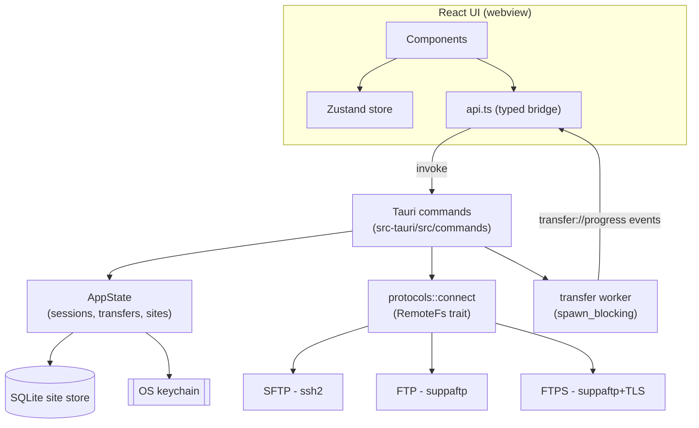

# Architecture

TurboFiles is a Tauri app: a React/TypeScript UI in a webview, talking to a Rust
backend over Tauri's IPC. All network and filesystem work lives in Rust; the UI
only renders state and dispatches commands.

## Layers

### Frontend (`src/`)
- **Components** (`components/`) — pure presentational React; no protocol logic.
- **State** (`store/useStore.ts`) — Zustand store: tabs, sites, entries,
  transfers, logs.
- **Bridge** (`lib/api.ts`) — one typed function per Tauri command, plus the
  `transfer://progress` event subscription. Mirrors `lib/types.ts`.
- **Theme** (`lib/theme.tsx`) — light/dark via a `.dark` class on `<html>` and CSS
  variables in `index.css`. Falls back to the system preference.
- A **demo mode** (`lib/demo.ts`) seeds data when running outside Tauri so the UI
  is developable in a plain browser.

### Backend (`src-tauri/src/`)
- **commands/** — the IPC surface. Async handlers offload blocking protocol I/O
  via `tauri::async_runtime::spawn_blocking`.
- **protocols/** — the `RemoteFs` trait and one module per protocol. Adding a
  protocol = one module + one match arm in `connect`.
- **transfer/** — `TransferControl` (atomic pause/cancel state) and a worker that
  performs a transfer and streams `transfer://progress` events.
- **storage/** — `SiteStore` (SQLite) for profiles, `keychain` for secrets.
- **state.rs** — `AppState` managed by Tauri: live sessions, transfers, controls,
  and the site store.
- **error.rs** — one `Error` enum serialized as `{ code, message }`.

## Key decisions

- **Blocking I/O on a thread pool.** `ssh2` and `suppaftp` are synchronous; running
  them on `spawn_blocking` keeps the async runtime responsive without forcing an
  async protocol stack.
- **Trait-based protocols.** The app depends only on `RemoteFs`, so protocols are
  swappable and independently testable.
- **Secrets isolated from data.** Profiles in SQLite, secrets in the keychain —
  the two never mix, limiting blast radius.
- **Events over polling.** Progress is pushed from the worker, so the UI never
  polls for transfer state.

See [ADR-0001](adr/0001-tech-stack.md) for the stack rationale.
